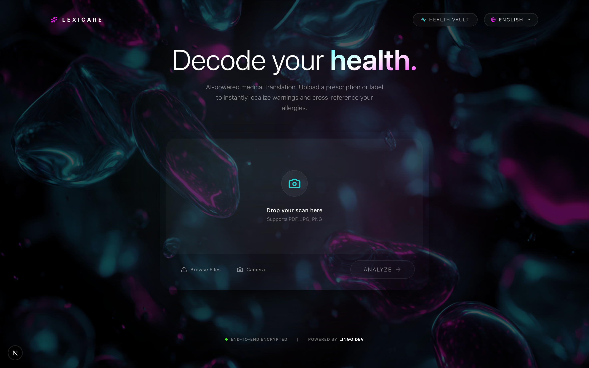

# ⚕️ LexiCare

**Decode your health, anywhere in the world.**

[](#)
[](#)
[](#)
[](#)

### 🔗 Quick Links

- **[🎥 Watch the Demo Video](https://youtu.be/pksIOf-5_IM)**
- **[🌐 Try the Live App](https://lexicare.netlify.app/)**



---

## 🌍 The Real-World Problem

Healthcare shouldn't have a language barrier, but the reality is terrifying for millions every day:

1. **The Traveler's Nightmare:** You get sick in a foreign country. You visit a local pharmacy, but the over-the-counter medicine box is covered in a language you can't read. If you have a severe allergy, a generic translation app's mistake could be fatal.
2. **The Patient's Confusion:** You get your doctor's prescription or lab report back, and it's written in complex medical jargon. Patients often have to wait days for a follow-up appointment just to find out that a scary word like _"Hyperlipidemia"_ simply means _"High Cholesterol"_.

## 💡 The Solution

**LexiCare** is a context-aware, AI-powered medical localization engine. We bridge the gap between complex medical data and patient understanding by combining advanced AI vision with flawless, culturally accurate translation.

Upload a prescription, lab report, or foreign medicine box. LexiCare instantly extracts the ingredients, simplifies the medical jargon, cross-references it against your personal Health Vault, and translates the life-saving warnings into your native language.

---

## ✨ Core Features


### 🔍 Scan & Simplify (AI OCR)

No more endless Googling. Upload an image of a lab report or medicine box, and LexiCare's AI extracts the active ingredients and decodes the complex jargon into plain, easy-to-understand terms.

### 🗄️ The Health Vault & Frictionless Updates

LexiCare learns about you. Scan a recent doctor's prescription, and the AI will list your newly prescribed medications. With a **single click**, you can add those medications directly to your encrypted digital Health Vault.

### ⚠️ Proactive Risk Detection

Scan an over-the-counter medicine box before you buy it. LexiCare instantly cross-references the detected ingredients against your personal Health Vault. If it detects a clash (e.g., an allergic reaction to Ibuprofen), it immediately flashes a critical warning.

### 🛡️ Safer Alternatives

We don't just alert you to danger; we provide solutions. If an allergic conflict is detected, the AI generates safe, alternative active ingredients that treat the same symptoms without triggering your allergies.

### 🌐 Flawless Medical Localization (Powered by Lingo.dev)

Standard translation apps give you raw, disjointed text. Translating medical data requires extreme precision and empathy. LexiCare uses the **Lingo.dev SDK** to instantly localize these critical health warnings into your native language on the fly, ensuring nothing is lost in translation.

---

## ⚙️ How It Works (The Architecture)

LexiCare is built for speed, safety, and scale:

1. **The Interface:** A premium, modern Next.js frontend featuring a sleek glassmorphism UI and dynamic React state management.
2. **The Brain (Google Gemini 1.5 Flash):** Processes the uploaded image via multimodal OCR. It strictly outputs English JSON containing the extracted ingredients, simplified jargon, and cross-referenced risk assessments based on the user's Health Vault.
3. **The Localization Engine (Lingo.dev):** The English JSON payload is securely passed to the Lingo.dev Node SDK. Because Lingo understands context, it translates the clinical warnings and alternatives into the user's target language (Spanish, French, Hindi, etc.) without losing medical accuracy.
4. **The Delivery:** The localized data is instantly rendered back to the user in a stunning, color-coded Bento Grid.

---

## 🏆 Why We Built with Lingo.dev

When dealing with medical warnings, literal word-for-word translation is dangerous. We integrated the official `lingo.dev/sdk` because it allows us to easily map dynamic JSON structures and maintain **strict medical context**.

By caching our initial AI extraction and relying on Lingo.dev for localization, our app allows users to seamlessly switch languages in real-time with near-zero latency, proving that Lingo.dev is the ultimate tool for high-stakes, global communication.

---

## 🚀 Getting Started

Want to run LexiCare locally? It takes less than 2 minutes.

**1. Clone the repository**

```bash
git clone https://github.com/tapas-code/LexiCare.git
cd lexicare
```

**2. Install Dependencies**

```bash
npm install
```

**3. Set up your environment variables**

Create a `.env.local` file in the root directory and add your API keys:

```env
GEMINI_API_KEY=your_google_gemini_key_here
LINGO_API_KEY=your_lingodev_key_here
```

**4. Run the development server**

```bash
npm run dev
```

Open [http://localhost:3000](http://localhost:3000) in your browser to see the application.

---

_Built with ❤️ for the **Lingo.dev** Hackathon._
